UNIVESIDAD DE SAN CARLOS DE GUATEMALA

FACULTAD DE INGENIERIA

ESCUELA DE CIENCAS Y SISTEMAS

ESTRUCTURAS DE DATOS

SECCIÓN A

VACACIONES SEGUNDO SEMESTRE 2023

AUX. CRISTIAN SUY

EDGAR ROLANDO RAMIREZ LOPEZ

201212891

Guatemala, Diciembre del 2023

# 
 **MANUAL DE USUARIO** 

# Introduccion

El Sistema de Tutorías Estudiantiles es una solución educativa integral diseñada para facilitar la asignación eficiente de tutores a estudiantes. Con una interfaz amigable, el programa permite a los administradores cargar datos masivos de tutores, estudiantes y cursos. Además, ofrece a los estudiantes la capacidad de visualizar tutores disponibles y asignarse automáticamente a través de un proceso transparente. La función de control de estudiantes proporciona herramientas para evaluar y gestionar las asignaciones basándose en criterios específicos. Los reportes detallados ofrecen información valiosa sobre alumnos, tutores, asignaciones y cursos. Este manual guiará a los usuarios a través de las funciones clave, garantizando una experiencia fluida y eficaz.

# Inicio de Sesión

Al iniciar la aplicación, se presentará un menú de inicio de sesión.

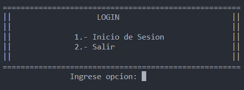

Ingrese el nombre de usuario y la contraseña correspondiente.

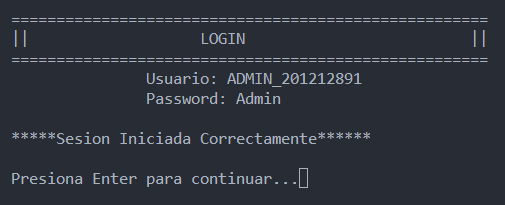

# Menú Principal Administrador

Al ingresar a este menu puedes elegir alguna de las siguientes opciones y cada uno tiene una funcion diferente.

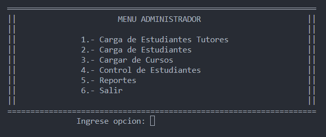

## Carga de Datos:

- **Cargar Tutores:** Permite cargar tutores desde un archivo CSV.

    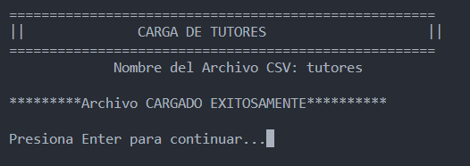

- **Cargar Estudiantes:** Permite cargar estudiantes desde un archivo CSV.

    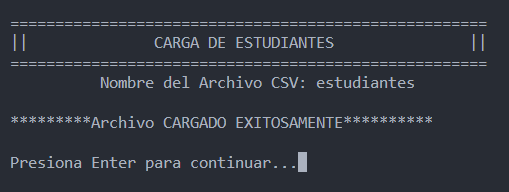

- **Cargar Cursos:** Permite cargar cursos desde un archivo JSON.

    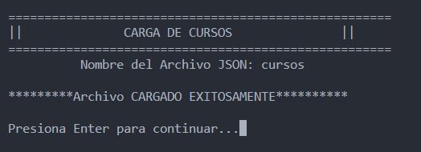

## Control de Estudiantes:

- **Aceptar/Rechazar Tutores:** Permite revisar y aceptar/rechazar tutores basándose en su puntaje.

    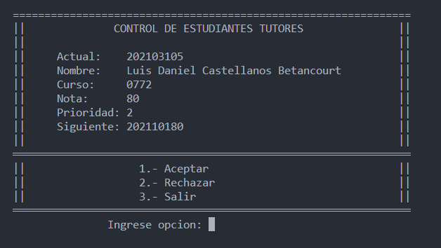

## Reportes:
Se muestra un menu donde se puede elegir algun reporte en especifico.

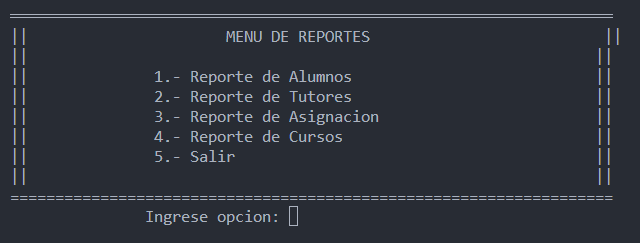

- **Reporte de Alumnos:** Muestra un informe de todos los estudiantes.

    

- **Reporte de Tutores:** Muestra un informe de todos los tutores.

    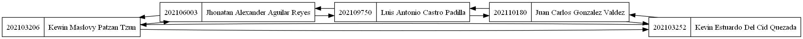

- **Reporte de Asignación:** Muestra un informe de la asignación de estudiantes a tutores.

    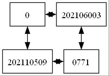

- **Reporte de Cursos:** Muestra un informe de todos los cursos.

    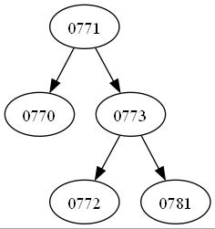

- **Salir:** Cierra la sesión actual.

# Menú Principal - Estudiante:
Para ingresar a este menu, se debe de ingresar con el carnet de un estudiante ingresado.

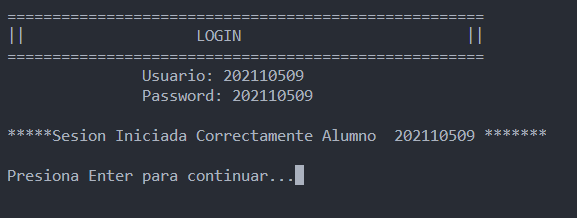

- **Ver Tutores Disponibles:** Muestra una lista de tutores disponibles para asignación.

    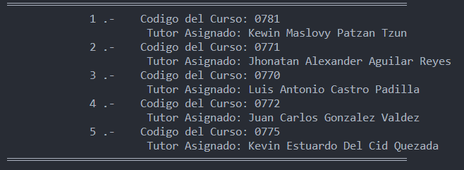

- **Asignarse a Tutores:** Ingresar Código del Curso y permite asignarse a un curso específico y tutor disponible.

    

- **Salir:** Cierra la sesión actual.

# Instrucciones Generales

- **Limpiar Pantalla:** La aplicación limpia la pantalla para mejorar la presentación de los menús.
- **Presionar Enter para Continuar:** En ciertos puntos, se solicitará presionar Enter para continuar.

# Conclusiones

El Sistema de Tutorías Estudiantiles ofrece una solución eficiente y fácil de usar para la gestión educativa. La capacidad de cargar datos masivos,asignar tutores automáticamente y evaluar asignaciones agiliza el proceso administrativo. La interfaz intuitiva brinda a los estudiantes la autonomía de seleccionar tutores según sus necesidades. Los reportes detallados permiten una supervisión completa del rendimiento del programa. 