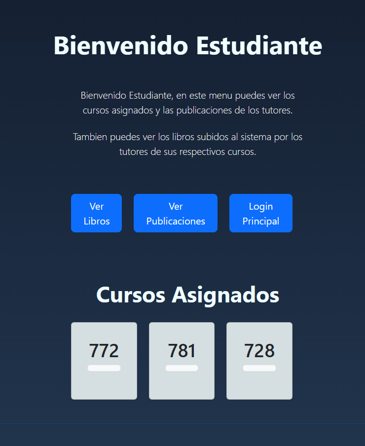
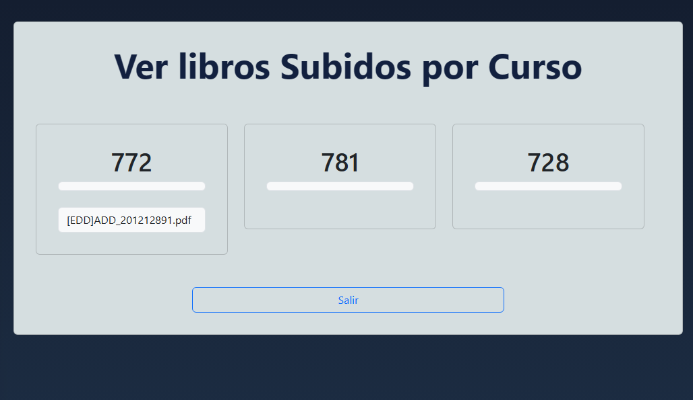

UNIVESIDAD DE SAN CARLOS DE GUATEMALA

FACULTAD DE INGENIERIA

ESCUELA DE CIENCAS Y SISTEMAS

ESTRUCTURAS DE DATOS

SECCIÓN A

VACACIONES SEGUNDO SEMESTRE 2023

AUX. CRISTIAN SUY

EDGAR ROLANDO RAMIREZ LOPEZ

201212891

Guatemala, Diciembre del 2023

# 
 **MANUAL DE USUARIO** 

# Introduccion

Bienvenido al sistema educativo integrado, una plataforma robusta que ofrece a estudiantes y tutores herramientas avanzadas para gestionar recursos académicos. A través de un backend eficiente, el programa permite a los usuarios verificar los libros subidos en cada curso asi como las publicaciones de los tutores, interactuar con un árbol de tutores y acceder a recursos educativos visualizados en un grafo. La seguridad está garantizada mediante encriptación SHA-256, y la interfaz fácil de usar facilita una experiencia educativa enriquecedora.

# Inicio de Sesión

Al iniciar la aplicación, se presentará un menú de inicio de sesión. Al principio solo se podra acceder como administrador, una vez cargado los archivos de tutores y alumnos, ellos mismos podran inidicar sesion.

Ingrese el nombre de usuario y la contraseña correspondiente.

# Menú Principal Administrador

Este menu principal es para los administradores unicamente. Al ingresar a este menu puedes elegir alguna de las siguientes opciones y cada uno tiene una funcion diferente.

## Carga de Archivos:

- **Cargar Tutores:** Permite cargar tutores desde un archivo CSV.

- **Cargar Alumnos:** Permite cargar estudiantes desde un archivo CSV.

- **Cargar Cursos:** Permite cargar cursos desde un archivo JSON.

    

## Control de Estudiantes:

- **Ver estudiantes Activos:** Permite verificar los estudiantes activos que se cargaron al sistema.

    

## Libros:

Se muestra un menu donde se puede aceptar o rechazar un libro que haya sido cargado por un tutor.

- **Aceptar** Acepta el libro para ser guardado en el sistema.

- **Rechazar:** Rechaza el libro y no lo guarda en el sistema.

- **Finalizar:** Finaliza el proceso para que se guarde en un arbol de merkle.

- **Salir:** Regresa al menu de administrador.

## Reportes:

Se muestra varias opciones donde se puede elegir algun reporte en especifico.

- **Reporte Arbol B:** Muestra un informe de todos los cursos, mostrando los requisitos y post requisitos.

    

- **Reporte Grafo:** Muestra un informe de todos los cursos.

    

- **Reporte Arbol Merkle:** Muestra un informe de las cadenas resultantes de las funciones hash a excepción de la última
línea que muestra los datos que se utilizó para esas funciones.

    

- **Salir:** Regresa al menu de administrador.

# Menú Principal - Tutor:

Para ingresar a este menu, se debe de ingresar con el carnet del tutor y su contraseña, y hay que tener checkeado el boton donde indica tutor.

En este menu podemos cargar libros y realizar publicaciones.

- **Carga de Libros:** En este el tutor puede cargar un archivo pdf, se abrira una ventana para buscar el archivo pdf y este se mostrara en la pagina.

    

- **Carga de Publicaciones:** En este apartado el tutor puede realizar publicaciones y cargarlas al sistema.

    

- **Login Principal:** Cierra la sesión actual.

# Menú Principal - Estudiante:

Para ingresar a este menu, se debe de ingresar con el carnet de un estudiante ingresado y su contraseña.

En este menu podemos ver los libros que fueron aceptados por el administrador, las publicaciones realizadas por los tutores y los cursos asignados del estudiante.

- **Ver Libros:** Muestra todos los libros que fueron subidos por un tutor y aceptados por el administrador. Los muestra por cada curso.

    

- **Ver Publicaciones:** Muestra todas las publicaciones que fueron subidos por un tutor en un curso.

    

- **Login Principal:** Cierra la sesión actual.

# Conclusiones

El Sistema de Tutorías Estudiantiles proporciona una experiencia completa y segura para estudiantes y tutores. Con funciones avanzadas como el árbol de tutores, el grafo interactivo y la gestión eficiente de recursos, los usuarios pueden disfrutar de una plataforma educativa eficaz y centrada en la colaboración. La encriptación SHA-256 garantiza la seguridad de los datos, brindando confianza y tranquilidad a los usuarios.